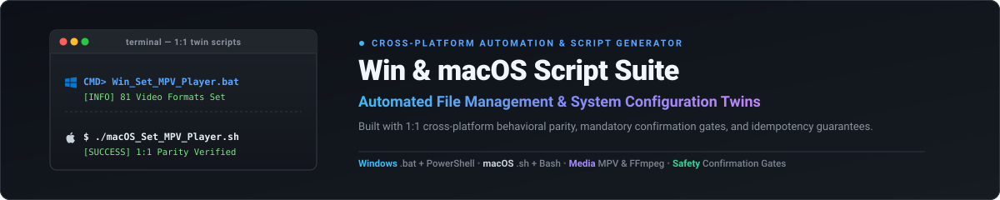

<div align="center">
  
</div>

<div align="center">

[](https://github.com/Biraj2004)
[](https://github.com/Biraj2004)
[](https://github.com/Biraj2004)
[](https://github.com/Biraj2004)
[](https://github.com/Biraj2004)
[](https://github.com/Biraj2004)

A production-grade collection of automated file-management and system configuration scripts for **Windows** (`.bat` backed by PowerShell) and **macOS** (`.sh` backed by Bash), engineered with strict visual branding, Safety Confirmation Gates, idempotency guarantees, and cross-platform functional parity.

</div>

---

## Script Pair Matrix

Every multi-platform script in the repository is built as part of a 1:1 twin pair. Windows scripts live in the root directory, while macOS twin scripts live inside `Mac-Equivalent-Scripts/`.

| Task / Purpose | Windows Script | macOS Twin Script | Key Action |
| :--- | :--- | :--- | :--- |
| **MPV Default Video Player** | [`Win_Set_MPV_As_Default_Video_Player.bat`](./Win_Set_MPV_As_Default_Video_Player.bat) | [`macOS_Set_MPV_As_Default_Video_Player.sh`](./Mac-Equivalent-Scripts/macOS_Set_MPV_As_Default_Video_Player.sh) | Registers and sets MPV (`io.mpv`) as default player for **all 81 video-only file formats** (MP4, MKV, MOV, WebM, AVI, MTS/M2TS, DVD, Raw, etc., safely excluding `.ts` to prevent TypeScript conflicts). |
| **Stremio MPV Integration** | [`Win_Setup_Stremio_To_Play_In_MPV.bat`](./Win_Setup_Stremio_To_Play_In_MPV.bat) | [`macOS_Setup_Stremio_To_Play_In_MPV.sh`](./Mac-Equivalent-Scripts/macOS_Setup_Stremio_To_Play_In_MPV.sh) | Injects MPV integration into Stremio's internal `server.js`, adding a native "Play in MPV" option alongside "Play in VLC". |
| **Auto-Numbering** | [`Win_Add_Prefix_Numberring_Based_On_Creation_Date_Ascending.bat`](./Win_Add_Prefix_Numberring_Based_On_Creation_Date_Ascending.bat) | [`macOS_Add_Prefix_Numberring_Based_On_Creation_Date_Ascending.sh`](./Mac-Equivalent-Scripts/macOS_Add_Prefix_Numberring_Based_On_Creation_Date_Ascending.sh) | Sorts Video (`.mp4`, `.mkv`, `.webm`) and PDF (`.pdf`) files by creation date and numbers them **independently** (`01..N` for videos, `01..M` for PDFs) in each folder. |
| **Remove Watermark** | [`Win_Remove_Hamaracollege_Text_From_Udemy_Videos.bat`](./Win_Remove_Hamaracollege_Text_From_Udemy_Videos.bat) | [`macOS_Remove_Hamaracollege_Text_From_Udemy_Videos.sh`](./Mac-Equivalent-Scripts/macOS_Remove_Hamaracollege_Text_From_Udemy_Videos.sh) | Scans for `@hamaracollege` / `@hmaracollege` (case-insensitive watermark tags) across media files and strips only the watermark tag text. |
| **Strip Numeric Prefix** | [`Win_Strip_Mismatched_Numbered_Prefix.bat`](./Win_Strip_Mismatched_Numbered_Prefix.bat) | [`macOS_Strip_Mismatched_Numbered_Prefix.sh`](./Mac-Equivalent-Scripts/macOS_Strip_Mismatched_Numbered_Prefix.sh) | Detects leading pure-numeric prefixes (`07-`, `12 -`) before the first hyphen on media files and removes them safely. |
| **Fix Double Extensions & Convert WebM** | [`Win_Fix_Double_Extensions_And_Convert_Webm_To_Mp4.bat`](./Win_Fix_Double_Extensions_And_Convert_Webm_To_Mp4.bat) | [`macOS_Fix_Double_Extensions_And_Convert_Webm_To_Mp4.sh`](./Mac-Equivalent-Scripts/macOS_Fix_Double_Extensions_And_Convert_Webm_To_Mp4.sh) | Strips double video extensions (`.mp4.mkv` -> `.mp4`) and converts standalone `.webm` files to `.mp4` preserving timestamps and metadata. |
| **FFmpeg Auto-Installer & PATH Setup** | [`Win_Install_FFmpeg_And_Set_Env_Path.bat`](./Win_Install_FFmpeg_And_Set_Env_Path.bat) | [`macOS_Install_FFmpeg_And_Set_Env_Path.sh`](./Mac-Equivalent-Scripts/macOS_Install_FFmpeg_And_Set_Env_Path.sh) | Verifies FFmpeg presence; if missing, automatically downloads the release build, installs it, and configures system environment PATH. |
| **Explorer Context Menu Cleaner** | [`Win_Clean_Explorer_Context_Menu_Entries.bat`](./Win_Clean_Explorer_Context_Menu_Entries.bat) | *N/A (Windows Registry Specific)* | Scans context menu registry locations (`Directory`, `Background`, `Folder`, `*` in `HKLM`/`HKCU`), detects missing executables / uninstalled app leftovers, creates `.reg` backups, and supports selective or bulk removal. |
| **Copy Path Context Menu Manager** | [`Win_Add_Remove_Copy_Path_Context_Menu.bat`](./Win_Add_Remove_Copy_Path_Context_Menu.bat) | [`macOS_Add_Remove_Copy_Path_Context_Menu.sh`](./Mac-Equivalent-Scripts/macOS_Add_Remove_Copy_Path_Context_Menu.sh) | Adds or removes "Copy File's Path" / "Copy Folder's Path" and "Copy Parent Folder's Path" options to Windows Explorer / macOS Finder right-click menus with zero console flicker, clean string formatting, and proper safety gates. |
| **Restart Windows Explorer** | [`Win_Restart_Windows_Explorer.bat`](./Win_Restart_Windows_Explorer.bat) | *N/A (Windows Explorer Specific)* | Gracefully terminates and relaunches `explorer.exe` to instantly refresh desktop, taskbar, and file explorer shell modifications without rebooting. |
| **Wi-Fi Card Switcher & Auto-Connect** | [`Win_Toggle_WiFi_Adapters_And_Auto_Connect.bat`](./Win_Toggle_WiFi_Adapters_And_Auto_Connect.bat) | *N/A (Windows Hardware Specific)* | Controls and switches between MediaTek Wi-Fi 6 MT7921 and TP-Link Wireless USB adapters, toggles cards independently or together, provisions profiles, and auto-connects to `BIRAJ HOME 5GHz`. |

---

## Key Architectural Features

1. **Independent Media Auto-Numbering**:
   - Course directories containing lecture videos and presentation slide PDFs receive independent numbering sequences (`01 - ` for videos, `01 - ` for PDFs).
   - Dynamic digit padding (`2-digit` for fewer than 100 files, `3+-digit` for 100 or more files).
2. **Safety Confirmation Gate**:
   - No script will mutate disk files, registry entries, or system settings without explicit `Y`/`YES` confirmation.
   - Declining the confirmation prompt exits cleanly with code `0` without making any modifications.
3. **PowerShell Execution Engines (Windows)**:
   - **Base64 Payload Engine**: File processing scripts pass execution to Base64 UTF-16LE Encoded PowerShell commands (`-EncodedCommand`), avoiding quote/escaping issues and supporting Unicode filenames natively.
   - **Hybrid Scriptblock Engine**: System, registry, and application-association tools (e.g. `Win_Set_MPV_As_Default_Video_Player.bat`, `Win_Clean_Explorer_Context_Menu_Entries.bat`) use the self-contained hybrid pattern (`<# : ... #>`) allowing complex interactive workflows without CMD command-line buffer constraints.
4. **Tasteful Color Hierarchy & Tag Vocabulary**:
   - Banners and Main Section Titles: **Cyan**
   - Body Text, Info Labels, and File Paths: **White** for maximum legibility
   - Status and Completion: **Green** (`[INFO]`, `[SUCCESS]`)
   - Warnings and Safety Gates: **Yellow** (`WARNING:`)
   - Errors: **Red** (`[ERROR]`)
   - Section Dividers: **Gray** (`===`, `---`)
   - Standard log tags: `[INFO]`, `[PROCESSING]`, `[FOLDER]`, `[SKIP]`, `[SET]`, `[RENAMED]`, `[ERROR]`, `[SUMMARY]`, `[SUCCESS]`.
5. **Idempotency Guarantee**:
   - Re-running any script is 100% safe. Files or settings that already meet the target criteria are logged as `[SKIP]` without duplicate actions or errors.
6. **Developer-Safe Association Guards**:
   - Video player association scripts purposely exclude `.ts` to eliminate conflicts with TypeScript source files, while supporting all remaining 81 transport stream and container formats (`.mts`, `.m2ts`, `.m2t`, `.tts`, `.tsv`, `.tsa`, `.trp`, `.mtv`).

---

## Quick Start & Usage

### Running on Windows
Place the `.bat` file into the target folder and double-click it, or execute from Command Prompt:

```cmd
Win_Set_MPV_As_Default_Video_Player.bat
```

To pass a custom MPV executable path:
```cmd
Win_Set_MPV_As_Default_Video_Player.bat "C:\your\path\to\mpv.exe"
```

### Running on macOS
Make the `.sh` file executable and run it from Terminal:

```bash
chmod +x Mac-Equivalent-Scripts/macOS_Set_MPV_As_Default_Video_Player.sh
./Mac-Equivalent-Scripts/macOS_Set_MPV_As_Default_Video_Player.sh
```

---

## Repository Structure

```text
.
├── assets/
│   └── banner.svg
├── guide/
│   ├── MACOS_SCRIPT_STYLE_GUIDE.md
│   ├── Test_Script.md
│   └── WIN_SCRIPT_STYLE_GUIDE.md
├── Mac-Equivalent-Scripts/
│   ├── macOS_Add_Prefix_Numberring_Based_On_Creation_Date_Ascending.sh
│   ├── macOS_Fix_Double_Extensions_And_Convert_Webm_To_Mp4.sh
│   ├── macOS_Install_FFmpeg_And_Set_Env_Path.sh
│   ├── macOS_Remove_Hamaracollege_Text_From_Udemy_Videos.sh
│   ├── macOS_Set_MPV_As_Default_Video_Player.sh
│   ├── macOS_Setup_Stremio_To_Play_In_MPV.sh
│   └── macOS_Strip_Mismatched_Numbered_Prefix.sh
├── README.md
├── Win_Add_Prefix_Numberring_Based_On_Creation_Date_Ascending.bat
├── Win_Clean_Explorer_Context_Menu_Entries.bat
├── Win_Fix_Double_Extensions_And_Convert_Webm_To_Mp4.bat
├── Win_Install_FFmpeg_And_Set_Env_Path.bat
├── Win_Remove_Hamaracollege_Text_From_Udemy_Videos.bat
├── Win_Restart_Windows_Explorer.bat
├── Win_Set_MPV_As_Default_Video_Player.bat
├── Win_Setup_Stremio_To_Play_In_MPV.bat
├── Win_Strip_Mismatched_Numbered_Prefix.bat
└── Win_Toggle_WiFi_Adapters_And_Auto_Connect.bat
```

---

## Documentation & Style Guides

- **[Windows Style Guide](./guide/WIN_SCRIPT_STYLE_GUIDE.md)**: Mandatory architecture, branding, and safety conventions for Windows `.bat` scripts.
- **[macOS Style Guide](./guide/MACOS_SCRIPT_STYLE_GUIDE.md)**: Mandatory standards for creating macOS `.sh` Bash twins.
- **[Test Script Guide & Harness](./guide/Test_Script.md)**: Automated testing methodology and verification harnesses.

---

## Author & Licensing

- **Developer**: Biraj
- **GitHub**: [https://github.com/Biraj2004](https://github.com/Biraj2004)